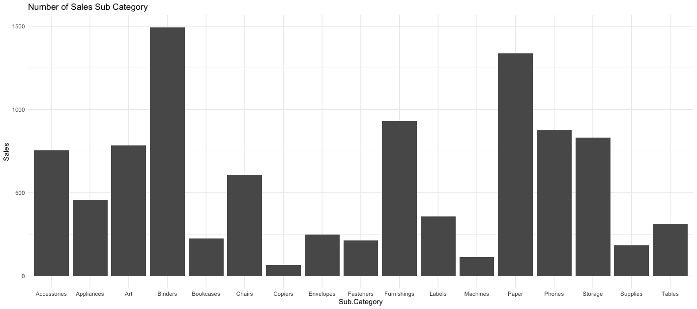
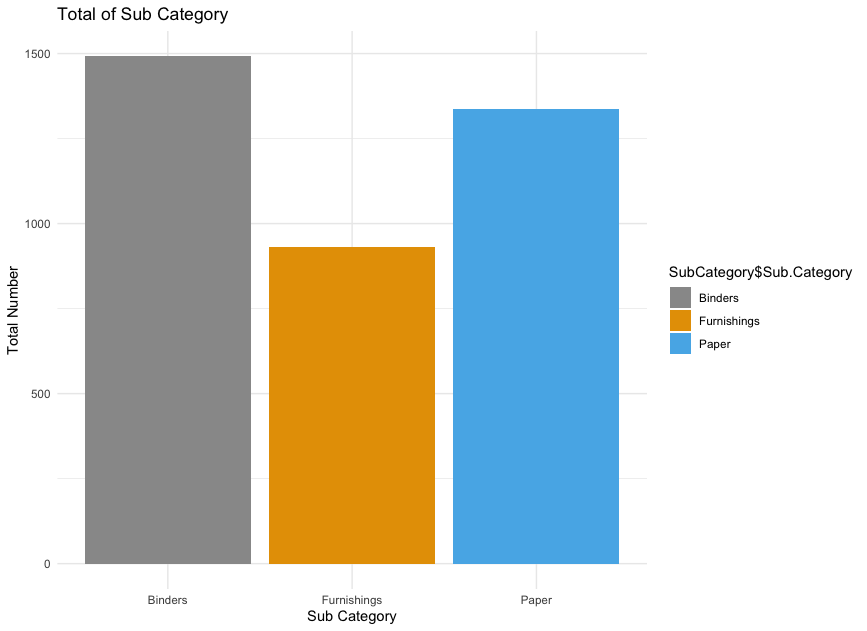

# R-Assignment 4

**Created by Thatphum Kongnithichalerm (ID: 63130500044)**

Choose Dataset:

Superstore Sales Dataset (Data from Rohit Sahoo,[Kaggle](https://www.kaggle.com/rohitsahoo/sales-forecasting)) >> [Using CSV](https://raw.githubusercontent.com/safesit23/INT214-Statistics/main/datasets/superstore_sales.csv)

### Outlines
1. Explore the dataset
2. Learning function from Tidyverse
3. Transform data with dplyr and finding insight the data
4. Visualization with GGplot2

## Part 1: Explore the dataset

```
library(dplyr)
library(stringr)
library(readr)
library(assertive)
library(tidyr)
library(ggplot2)

#Dataset
superstore_sale <- read.csv("https://raw.githubusercontent.com/safesit23/INT214-Statistics/main/datasets/superstore_sales.csv")

glimpse(superstore_sale)

```
ข้อมูลใน Dataset
```
Rows: 9,800
Columns: 18
$ Row.ID        <int> 1, 2, 3, 4, 5, 6, 7, 8, 9, 10, 11, 12, 13, 14, 15, 16, 17, 18, 19, 20, 21, 22, 23, 24, 25, 26, 27, 28…
$ Order.ID      <chr> "CA-2017-152156", "CA-2017-152156", "CA-2017-138688", "US-2016-108966", "US-2016-108966", "CA-2015-11…
$ Order.Date    <chr> "08/11/2017", "08/11/2017", "12/06/2017", "11/10/2016", "11/10/2016", "09/06/2015", "09/06/2015", "09…
$ Ship.Date     <chr> "11/11/2017", "11/11/2017", "16/06/2017", "18/10/2016", "18/10/2016", "14/06/2015", "14/06/2015", "14…
$ Ship.Mode     <chr> "Second Class", "Second Class", "Second Class", "Standard Class", "Standard Class", "Standard Class",…
$ Customer.ID   <chr> "CG-12520", "CG-12520", "DV-13045", "SO-20335", "SO-20335", "BH-11710", "BH-11710", "BH-11710", "BH-1…
$ Customer.Name <chr> "Claire Gute", "Claire Gute", "Darrin Van Huff", "Sean O'Donnell", "Sean O'Donnell", "Brosina Hoffman…
$ Segment       <chr> "Consumer", "Consumer", "Corporate", "Consumer", "Consumer", "Consumer", "Consumer", "Consumer", "Con…
$ Country       <chr> "United States", "United States", "United States", "United States", "United States", "United States",…
$ City          <chr> "Henderson", "Henderson", "Los Angeles", "Fort Lauderdale", "Fort Lauderdale", "Los Angeles", "Los An…
$ State         <chr> "Kentucky", "Kentucky", "California", "Florida", "Florida", "California", "California", "California",…
$ Postal.Code   <int> 42420, 42420, 90036, 33311, 33311, 90032, 90032, 90032, 90032, 90032, 90032, 90032, 28027, 98103, 761…
$ Region        <chr> "South", "South", "West", "South", "South", "West", "West", "West", "West", "West", "West", "West", "…
$ Product.ID    <chr> "FUR-BO-10001798", "FUR-CH-10000454", "OFF-LA-10000240", "FUR-TA-10000577", "OFF-ST-10000760", "FUR-F…
$ Category      <chr> "Furniture", "Furniture", "Office Supplies", "Furniture", "Office Supplies", "Furniture", "Office Sup…
$ Sub.Category  <chr> "Bookcases", "Chairs", "Labels", "Tables", "Storage", "Furnishings", "Art", "Phones", "Binders", "App…
$ Product.Name  <chr> "Bush Somerset Collection Bookcase", "Hon Deluxe Fabric Upholstered Stacking Chairs, Rounded Back", "…
$ Sales         <dbl> 261.9600, 731.9400, 14.6200, 957.5775, 22.3680, 48.8600, 7.2800, 907.1520, 18.5040, 114.9000, 1706.18…
```
ภายใน dataset ประกอบไปด้วยข้อมูลจำนวน 9,800 Row และ 18 Columns โดยที่
- Row.ID : ลำดับ
- Order.ID : ID ของ Order 
- Order.Date : วันที่สั่ง
- Ship.Date : วันส่งของ
- Ship.Mode : ส่งโดยแบบใด
- Customer.ID : ID ลูกค้า
- Customer.Name : ชื่อลูกค้า
- Segment : สั่งในนาม
- Country : ประเทศ
- City : เมือง
- State : สถานะ
- Postal.Code : เลขไปรษณีย์
- Region : 	ภูมิภาค
- Product.ID : ID ของสินค้า
- Category : ประเภทของสินค้า
- Sub.Category : ประเภทย่อย
- Product.Name : ชื่อสินค้า
- Sales : ราคา

## Part 2: Learning function from Tidyverse

- Function `select()` from package [dplyr](https://dplyr.tidyverse.org/reference/select.html). : เลือกคอมลัมน์ที่เราต้องการให้แสดงผลออกมา

```
Select_Customer <- superstore_sale %>% select(`Customer.ID` , `Customer.Name` , Sales , City) 

as_tibble(Select_Customer)
```
Result:
```
# A tibble: 9,800 × 4
   Customer.ID Customer.Name    Sales City           
   <chr>       <chr>            <dbl> <chr>          
 1 CG-12520    Claire Gute     262.   Henderson      
 2 CG-12520    Claire Gute     732.   Henderson      
 3 DV-13045    Darrin Van Huff  14.6  Los Angeles    
 4 SO-20335    Sean O'Donnell  958.   Fort Lauderdale
 5 SO-20335    Sean O'Donnell   22.4  Fort Lauderdale
 6 BH-11710    Brosina Hoffman  48.9  Los Angeles    
 7 BH-11710    Brosina Hoffman   7.28 Los Angeles    
 8 BH-11710    Brosina Hoffman 907.   Los Angeles    
 9 BH-11710    Brosina Hoffman  18.5  Los Angeles    
10 BH-11710    Brosina Hoffman 115.   Los Angeles    
# … with 9,790 more rows
```

## Part 3: Transform data with dplyr and finding insight the data
### 1. หาลูกค้าที่ซื้อราคาสินค้ามากกว่าค่าเฉลี่ย และอยู่ในเมือง Henderson  โดยให้แสดง CustomerID , CustomerName , Sales , City
```
superstore_sale %>% select(`Customer.ID` , `Customer.Name` , Sales , City) %>% 
  filter(Sales >= mean(Sales) , City == "Henderson")
```
Result :
```
   Customer.ID    Customer.Name   Sales      City
1     CG-12520      Claire Gute  261.96 Henderson
2     CG-12520      Claire Gute  731.94 Henderson
3     DK-12985   Darren Koutras  283.92 Henderson
4     KC-16255   Karen Carlisle  364.80 Henderson
5     AB-10105    Adrian Barton  821.88 Henderson
6     DB-12910      Daniel Byrd  671.93 Henderson
7     AP-10915   Arthur Prichep  842.94 Henderson
8     TB-21175    Thomas Boland  975.92 Henderson
9     TB-21175    Thomas Boland 2249.91 Henderson
10    LW-16990 Lindsay Williams 1685.88 Henderson
11    ME-17320    Maria Etezadi 2573.82 Henderson
12    ME-17320    Maria Etezadi  609.98 Henderson
13    ME-17320    Maria Etezadi  391.98 Henderson
14    ME-17320    Maria Etezadi  755.96 Henderson
15    DB-13555  Dorothy Badders  828.84 Henderson
16    GW-14605 Giulietta Weimer  318.08 Henderson
17    AH-10210       Alan Hwang 1577.94 Henderson
```
### 2. แสดงจำนวนคนสั่งของในแต่ละเมือง
```
superstore_sale %>% group_by(City) %>% summarise("total" = length(City))
```
Result :
```
# A tibble: 529 × 2
   City        total
   <chr>       <int>
 1 Aberdeen        1
 2 Abilene         1
 3 Akron          20
 4 Albuquerque    14
 5 Alexandria     16
 6 Allen           4
 7 Allentown       7
 8 Altoona         2
 9 Amarillo       10
10 Anaheim        19
# … with 519 more rows
```

### 3.แสดง IDและชื่อ ของสินค้าที่มีราคาถูกที่สุดที่ลูกค้าได้ซื้อไป
```
superstore_sale %>% select(Product.ID , Product.Name , Sales) %>% filter(Sales == min(Sales))
```
Result :
```
       Product.ID                                                               Product.Name Sales
1 OFF-AP-10002906 Hoover Replacement Belt for Commercial Guardsman Heavy-Duty Upright Vacuum 0.444
```

### 4. 5 อันดับลูดค้าที่ซื้อสินค้ามากที่สุด (แสดง ID ชื่อ) 
```
superstore_sale %>% select(Customer.ID , Customer.Name) %>% group_by(Customer.Name) %>% count(Customer.ID) %>% arrange(desc(n)) %>% head(5) 
```
Result :
```
# A tibble: 5 × 3
# Groups:   Customer.Name [5]
  Customer.Name       Customer.ID     n
  <chr>               <chr>       <int>
1 William Brown       WB-21850       35
2 Matt Abelman        MA-17560       34
3 Paul Prost          PP-18955       34
4 John Lee            JL-15835       33
5 Chloris Kastensmidt CK-12205       32
```

### 5. หาสินค้าประเภทย่อยที่ถูกซื้อไปมากที่สุด
```
superstore_sale %>% select(Sub.Category) %>% count(Sub.Category) %>% arrange(desc(n)) %>% head(1)
```
Result :
```
  Sub.Category    n
1      Binders 1492
```

### 6. ในหมวดของประเภทสินค้าที่มีคนซื้อ เรียงลำดับจากมากไปน้อย
```
superstore_sale %>% select(Category) %>% count(Category) %>% arrange(desc(n))
```
Result :
```
         Category    n
1 Office Supplies 5909
2       Furniture 2078
3      Technology 1813
```

## Part 4: Visualization with GGplot2
### 1. กราฟแสดงราคาของสินค้าประเภทย่อย
```
PlotSC <- ggplot(superstore_sale , aes(x= Sub.Category)) + geom_bar() + theme_minimal()
PlotSC + ggtitle("Number of Sales Sub Category") + xlab("Sub.Category") + ylab("Sales")
```
Result :


### 2. กราฟแสดงจำนวนการซื้อของสินค้าประเภทย่อย ที่มรการซื้อมากที่สุด 3 อันดับแรก
```
SubCategory <- superstore_sale %>% select(Sub.Category) %>% count(Sub.Category) %>% arrange(desc(n)) %>% head(3)

PlotSCNumber <- ggplot(SubCategory , aes(x = SubCategory$Sub.Category , y = SubCategory$n , fill = SubCategory$Sub.Category)) + 
  geom_bar(stat = "identity") + theme_minimal()

PlotSCNumber + scale_fill_manual(values = c("#999999","#E69F00","#56B4E9")) + ggtitle("Total of Sub Category") + xlab("Sub Category") + ylab("Total Number")
```
Result :

