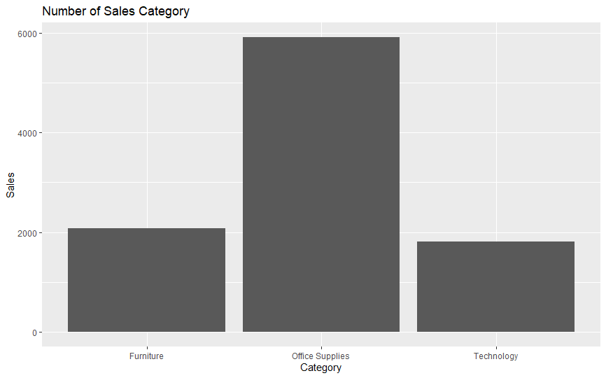
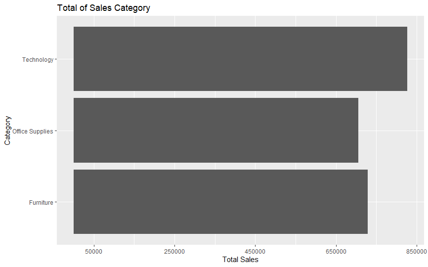

# R-Assignment 4

**Created by Thanakrit Cankha (ID: 63130500045)**

Choose Dataset:
Superstore Sales Dataset (Data from Rohit Sahoo,[Kaggle](https://www.kaggle.com/rohitsahoo/sales-forecasting)) >> [Using CSV](https://raw.githubusercontent.com/safesit23/INT214-Statistics/main/datasets/superstore_sales.csv)

### Outlines
1. Explore the dataset
2. Learning function from Tidyverse
3. Transform data with dplyr and finding insight the data
4. Visualization with GGplot2

## Part 1: Explore the dataset

```
library(dplyr)
library(readr)
library(stringr)
library(tidyr)
library(assertive)
library(ggplot2)

# Dataset
Superstore_Sales <- read_csv("https://raw.githubusercontent.com/safesit23/INT214-Statistics/main/datasets/superstore_sales.csv");

View(Superstore_Sales);

```

## Part 2: Learning function from Tidyverse

```
- Function `select()` from package [dplyr](https://dplyr.tidyverse.org/articles/dplyr.html#select-columns-with-select)). It using for select columns

starwars %>% select(name,height)

** You can sepearate this part or combine in part of `Transform data with dplyr and finding insight the data`

```

## Part 3: Transform data with dplyr and finding insight the data

### 1. ลูกค้าที่มีการซื้อสินค้าน้อยที่สุด  
```
customerMostBuy <- Superstore_Sales %>% select(`Customer ID`,`Customer Name`,Sales) %>% filter(Superstore_Sales$Sales == min(Superstore_Sales$Sales));

```
Result:

```
`Customer ID` `Customer Name`  Sales
  <chr>         <chr>            <dbl>
1 ZC-21910      Zuschuss Carroll 0.444
```
ลูกค้าที่มีการซื้อสินค้าน้อยที่สุดคือ Zuschuss Carroll

### 2. จงหาข้อมูลการซื้อของลูกค้าที่อยู่ในเมือง New York City

```
NY_Customer <- Superstore_Sales %>% select(`Customer Name`, City, `Product Name`) %>% filter(City == "New York City");

as_tibble(NY_Customer);

```
Result :

```

 `Customer Name`   City          `Product Name`                                                                        
   <chr>             <chr>         <chr>                                                                                 
 1 Janet Molinari    New York City Advantus Push Pins                                                                    
 2 Janet Molinari    New York City AT&T CL83451 4-Handset Telephone                                                      
 3 Henry MacAllister New York City Avery Binding System Hidden Tab Executive Style Index Sets                            
 4 Parhena Norris    New York City 9-3/4 Diameter Round Wall Clock                                                       
 5 Cynthia Voltz     New York City Magnifier Swing Arm Lamp                                                              
 6 Jim Kriz          New York City Sanford Colorific Eraseable Coloring Pencils, 12 Count                                
 7 Mark Packer       New York City Atlantic Metals Mobile 4-Shelf Bookcases, Custom Colors                               
 8 Mark Packer       New York City I Need's 3d Hello Kitty Hybrid Silicone Case Cover for HTC One X 4g with 3d Hello Kit~
 9 Mark Packer       New York City Xerox 205                                                                             
10 Mark Packer       New York City Atlantic Metals Mobile 3-Shelf Bookcases, Custom Colors                               
# ... with 881 more rows
```
นี่คือข้อมูลของลูกค้าที่อยู่ในเมือง New York City

### 3. จงหาราคาซื้อที่มากที่สุด

```
maxsales <- Superstore_Sales %>% select(Sales) %>% max(Superstore_Sales$Sales);

as_tibble(maxsales);

```
Result :

```
value
   <dbl>
1 22638.

```
ราคาซื้อที่มากที่สุดก็คือ 22638

### 4. ลูกค้าที่ซื้อของที่ราคามากกว่าค่าเฉลี่ยที่อยู่ในเมือง Los Angeles

```
LA_Overmean <- Superstore_Sales %>% select(`Customer ID` , `Customer Name` , Sales , City) %>% filter(Sales >= mean(Sales) , City == "Los Angeles");

```

Result :

```
`Customer ID` `Customer Name`  Sales City       
   <chr>         <chr>            <dbl> <chr>      
 1 BH-11710      Brosina Hoffman   907. Los Angeles
 2 BH-11710      Brosina Hoffman  1706. Los Angeles
 3 BH-11710      Brosina Hoffman   911. Los Angeles
 4 LS-16975      Lindsay Shagiari  239. Los Angeles
 5 CS-12130      Chad Sievert      340. Los Angeles
 6 JH-15910      Jonathan Howell   302. Los Angeles
 7 JO-15280      Jas O'Carroll    1039. Los Angeles
 8 DB-13615      Doug Bickford     960. Los Angeles
 9 PB-19150      Philip Brown      384. Los Angeles
10 MT-18070      Michelle Tran     514. Los Angeles
# ... with 183 more rows

```
### 5. แสดงการจำนวนการซื้อขายในแต่ละภาคแลและแสดงผลแบบมากไปน้อย

```
totalSales <- sum(Superstore_Sales$Sales);

as_tibble(totalSales);
```
Result :

```
`Superstore_Sales$Region`     n
  <chr>                     <int>
1 West                       3140
2 East                       2785
3 Central                    2277
4 South                      1598
```
### 6. แสดงจำนวนการซื้อของลูกค้าทั้งหมดและเรียงลำดับจากมากไปน้อย

```
countcus <- Superstore_Sales %>% select(`Customer Name`) %>% count(Superstore_Sales$`Customer Name`) %>% arrange(desc(n));

as_tibble(countcus);
```
Result :

```
`Superstore_Sales$\`Customer Name\``     n
   <chr>                                <int>
 1 William Brown                           35
 2 Matt Abelman                            34
 3 Paul Prost                              34
 4 John Lee                                33
 5 Chloris Kastensmidt                     32
 6 Jonathan Doherty                        32
 7 Seth Vernon                             32
 8 Arthur Prichep                          31
 9 Emily Phan                              31
10 Zuschuss Carroll                        31
# ... with 783 more rows
```
## Part 4: Visualization with GGplot2

### 1. ทำกราฟแสดงผลระหว่าง Category และ Sales

```
Category_plot <- ggplot(Superstore_Sales, aes(x= Category)) + geom_bar(); 

Category_plot + ggtitle("Number of Sales Category") +  xlab("Category") + ylab("Sales")
```
Result :



### 2. ทำกราฟแสดงผลรวมของการซื้อขายในแต่ละหมวดหมู่

```
Country_plot <- ggplot(Superstore_Sales, aes(x = Sales, y = Category))+
  geom_bar(stat="identity")+
  scale_x_continuous(breaks=c(50000 ,250000 ,450000 ,650000 ,850000))

Country_plot + ggtitle("Total of Sales Category") +
  xlab("Total Sales") + ylab("Category")
```
Resulet :

